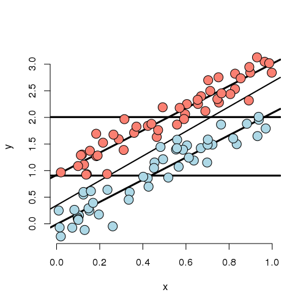
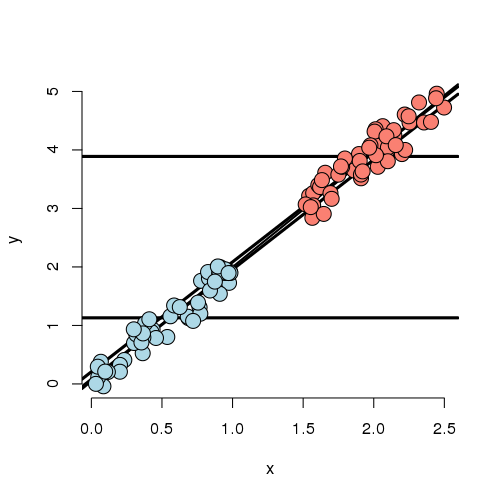
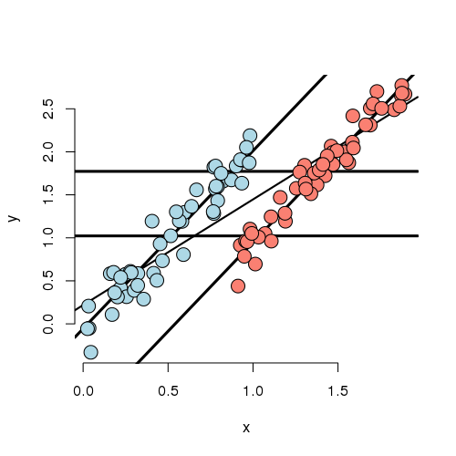
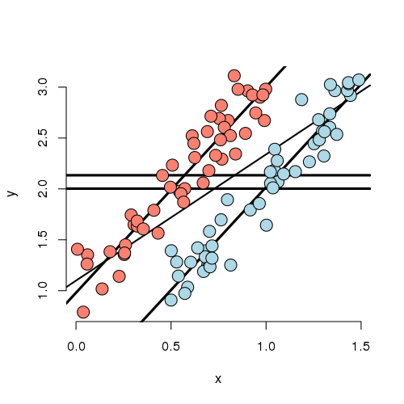
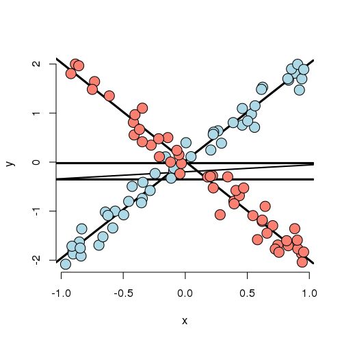

B0;256;0c# Adjustment

[Watch this video before beginning.](https://youtu.be/SFPM9IuP2m8)

Adjustment, is the idea of putting regressors into a linear model to
investigate the role of a third variable on the relationship between
another two. Since it is often the case that a third variable can
distort, or confound, the relationship between two others.

As an example, consider looking at lung cancer rates and breath mint
usage. For the sake of completeness, imagine if you were looking
at forced expiratory volume (a measure of lung function) and breath
mint usage.  If you found a statistically significant regression relationship, it
wouldn't be wise to rush off to the newspapers with the headline
"Breath mint usage causes shortness of breath!", for a variety of reasons.
First off, even if the association is sound, you don't know that it's
causal. But, more importantly in this case, the likely culprit
is smoking habits. Smoking rates are likely related to both breath mint
usage rates and lung function. How would you defend your finding
against the accusation that it's just variability in smoking habits?

If your finding held up among non-smokers and smokers analyzed
separately, then you might have something. In other words, people
wouldn't even begin to believe this finding unless it held up
while holding smoking status constant. That is the idea of
adding a regression variable into a model as adjustment. The
coefficient of interest is interpreted as the effect of the
predictor on the response, holding the adjustment variable
constant.

In this chapter, we'll use simulation to
investigate how adding a regressor into a model addresses
the idea of adjustment.

## Experiment 1

Let's first generate some data. Consider the model

{$$}Y_i = \beta_0 + \beta_1 X + \tau T  + \epsilon_i{/$$}

We're interested in the relationship between our binary treatment,
{$$}T{/$$}, and
{$$}Y{/$$}. However, we're concerned that the relationship
may depend on the continuous variable, {$$}X{/$$}.

Let's simulate some data.

{lang=r,line-numbers=off}
~~~
n <- 100; t <- rep(c(0, 1), c(n/2, n/2)); x <- c(runif(n/2), runif(n/2));
beta0 <- 0; beta1 <- 2; tau <- 1; sigma <- .2
y <- beta0 + x * beta1 + t * tau + rnorm(n, sd = sigma)
~~~

Let's plot the data. Below I give the code for the first plot; the rest
of the code for plots throughout this chapter is omitted. (However,
you can see the course git repository for the rest of the code.)

{lang=r,line-numbers=off,title="Simulation 1"}
~~~
plot(x, y, type = "n", frame = FALSE)
abline(lm(y ~ x), lwd = 2)
abline(h = mean(y[1 : (n/2)]), lwd = 3)
abline(h = mean(y[(n/2 + 1) : n]), lwd = 3)
fit <- lm(y ~ x + t)
abline(coef(fit)[1], coef(fit)[2], lwd = 3)
abline(coef(fit)[1] + coef(fit)[3], coef(fit)[2], lwd = 3)
points(x[1 : (n/2)], y[1 : (n/2)], pch = 21, col = "black", bg = "lightblue", cex = 2)
points(x[(n/2 + 1) : n], y[(n/2 + 1) : n], pch = 21, col = "black", bg = "salmon", cex = 2)
~~~

Looking at this plot, notice that the X variable is
unrelated to treatment/group status (color). In addition, the X variable
is clearly linearly related to Y, but the intercept
of this relationship depends on group status. The treatment variable is also
related to Y; especially look at the horizontal lines
which connect the group means to the Y axis. The third line is the
what you would get if you just fit X and ignored group.
Furthermore, notice that the relationship between group status and Y is constant depending on X.
In other words, both the apparent relationship and our estimated model have parallel lines. (Remember, our
  model, by not including an interaction term, did not allow for estimated non-parallel lines.)

Finally, notice that the estimated relationship between the group variable and the outcome doesn't
change much, regardless of whether X is accounted for or not. You can see this by comparing the
distance between the horizontal lines and the distance between the intercepts of the fitted lines. The horizontal lines are the group averages (disregarding X).
That the relationship doesn't change much is ultimately a statement about balance. The nuisance variable (X) is well balanced between
levels of the group variable. So, whether you account for X or not, you get about the same answer. Moreover, we have lots of data at every level of
X to make a direct comparison of the group on Y.
One way to try to achieve such balance with high probability is to randomize the group variable. This is especially useful,
of course, when one doesn't get to observe the nuisance covariate. Though be careful that as the number
of unobserved covariates

Now let's consider less ideal settings.

## Experiment 2

In this experiment, the X variable is highly related to group status.
That is, if you know the X variable, you could very easily predict
which group they belonged to. If we disregard X, there's an apparent
strong relationship between the group variable and Y. However, if
we account for X, there's basically none. In this case, the apparent
effect of group on Y is entirely explained by X. Our regression
model would likely have a strong significant effect if group was
included by itself and this effect would vanish if X was included.

Further notice, there are no data to directly compare the groups
at any particular value of X. (There's no vertical overlap
between the blue and red points.) Thus the adjusted effect
is entirely based on the model, specifically the assumption
of linearity. Try to draw curves on this plot assuming
non-linear relationships outside of their cloud of points
for the blue and red groups. You quickly will conclude
that many relationship are possible that would differ
from this model's conclusions. Worse still, you have no data to
check the assumptions. Of course, R will churn forward without
any complaints fitting this model and reporting no significant
difference between the groups.

It's worth noting at this point, that our experiments
just show how the data can arrive at different effects
when X is included or not. In a real application,
it may be the case that X should be
included and maybe that it shouldn't be.

For example,
consider an example that I was working on a few years ago. Imagine
if group was whether or not the subject was
taking blood pressure medication and X was systolic blood pressure
(ostensibly, the two variable giving the same information). It may
not make sense to adjust for blood pressure when looking at blood
pressure medication on the outcome.

On the other hand consider another setting I ran into. A colleague was
studying chemical brain measurements of patients with a severe mental
disorder versus controls post mortem.  However, the time since death
was highly related to the time the brain was stored since death,
perhaps due to the differential patient sources of the two groups. The
time since death was strongly related to the outcome we were studying.
In this case, it is very hard to study the groups as they were so
contaminated by this nuisance covariate.

Thus we arrive at the conclusion that whether or not to include
a covariate is a complex process relying on both the statistics and
a careful investigation into the subject matter being studied.

## Experiment 3

In this experiment, we simulated data where the marginal (ignoring X)
and conditional (using X) associations differ. First note that
if X is ignored, one would estimate a higher marginal mean for Y
of the red group over the blue group. However, if we look at the
intercept in the fitted model, the blue group has a higher
intercept. In other words, if you were to fit this linear
model as `lm(Y ~ Group)` you would get one answer and
`lm(Y ~ Group + X)` would give you the exact opposite answer,
and in both cases the group effect would be highly statistically
significant!

Also in this settings, there isn't a lot of overlap
between the groups for any given X. That means there
isn't a lot of direct evidence to compare the groups
without relying heavily on the model. In other words,
group status is related to X quite strongly (though not
  as strongly as in the previous example). The adjusted
relationship suggest that the blue group is larger
than the red group. However, the reversal
of the effect comes as
bigger X means more likely red and bigger X means
higher Y.

Let's concoct an example around a way this data could
have occurred. Suppose
that you're comparing two ad campaigns (labeled
blue and red). Y is the sales from the ad (suppose you can measure this)
and X is time of day that the ad is shown. Ads
shown later on in the day do better than ads
shown earlier. However, the blue ad campaign
tended to get run in the morning while the
red one tended to get run in the evening. So,
ignoring time of day leads to the erroneous
conclusion that the the red ad did better. Again
randomization of the ads to time slots would
likely have eliminated this problem.

## Experiment 4

Now that you've gotten the hang of it. You can
see how marginal and conditional associations
can differ. Experiment 4 is a case where the marginal association
is minimal yet the conditional association is large.
In this case, by adding X to the model, the group
effect became more statistically significant.

## Experiment 5

Let's look at a weird one. In this case,
the best fitting model has both a group main
effect and interaction with X. The main point here
is that there is no meaningful group effect, the
effect of group depends on what level of X you're
at. At a small value of X, the red group is here
and at a large value of X, the blue group is higher;
at intermediate values, they're the same. Thus, it
makes no sense to talk about a group effect in this
example; group and X are intrinsically linked in their
impact on Y.

As an example, imagine if Y is health outcome, X is time
and group is two medications. One makes you much better
right away then much worse as time goes on and the other
doesn't do much at the start but steadily improves symptoms
over time. Of course, most examples seen in practice aren't that
extreme. Still even with a slight departure in constant slopes,
the meaning of a main group effect goes away.

## Some final thoughts

Nothing we've discussed is intrinsic to having a discrete group and
continuous X. One, the other, both or neither could be discrete. What
this reinforces is that modeling multivariable relationships is hard.
You should continue to play around with simulations to see how the
inclusion or exclusion of another variable can change apparent
relationships.

We should also caution that our discussion only dealt with
associations. Establishing causal or truly mechanistic
relationships requires quite a bit more thinking.

## Exercises
1. Load the dataset `Seatbelts` as part of the `datasets` package via `data(Seatbelts)`. Use
`as.data.frame` to convert the object to a dataframe. Fit a linear model of driver deaths
with `kms` and `PetrolPrice` as predictors. Interpret your results.
2. Compare the `kms` coefficient with and without the inclusion of the `PetrolPrice` variable in the model. [Watch a video solution.](https://www.youtube.com/watch?v=LTTsm8FfgeI&index=43&list=PLpl-gQkQivXji7JK1OP1qS7zalwUBPrX0)
3. Compare the `PetrolPrice` coefficient with and without the inclusion of the `kms` variable in the model.
