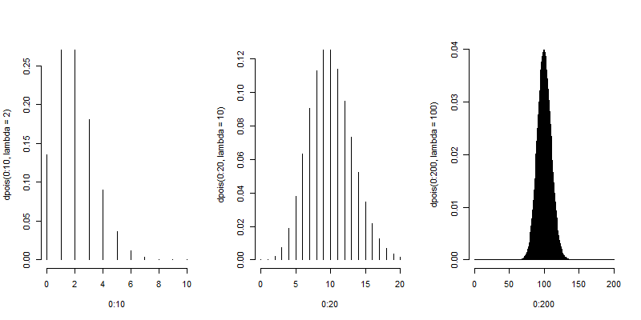
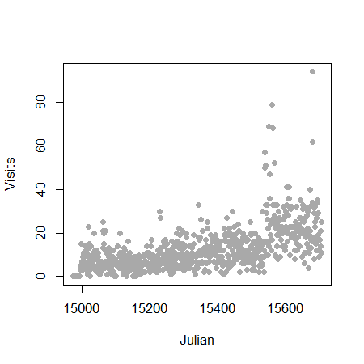
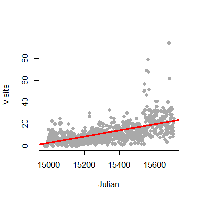
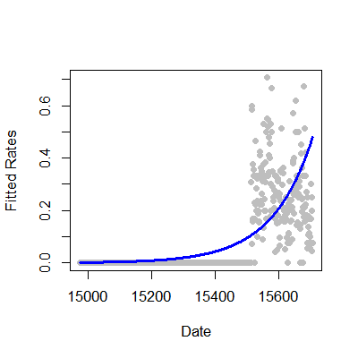

# Count data
Acknowledgement to Jeff Leek for much of the code and organization of this chapter.

Many data take the form of unbounded count
data. For example, consider the number of calls
to a call center or the number of flu cases
in an area or the number of hits to a web site.

In some of these cases the counts are clearly
bounded. However, modeling the counts as unbounded
is often done when the upper limit is not known
or very large relative to the number of events.

If the upper bound is known, the techniques we're
discussing can be used to model the proportion or
rate. The
starting point for most count analysis is the
the Poisson distribution.


## Poisson distribution

The Poisson distribution is the goto distribution for modeling
counts and rates. We'll define a rate as a count per unit of time.
For example your heart rate is often expressed in beats per minute.
So, we might look at web hits per day, or disease cases per
exposure time (incidence rates). Also, though not exactly a rate,
we can treat proportions as if rates when {$$}n{/$$} is large
and the success probability is small.

We would write that a random variable is Poisson,
{$$}X \sim \mathrm{Poisson}(t\lambda){/$$}, if its density function is:

{$$}
P(X = x) = \frac{(t\lambda)^x e^{-t\lambda}}{x!}
{/$$}

where {$$}x = 0, 1, \ldots{/$$}. The
mean of the Poisson is {$$}E[X] = t\lambda{/$$}, thus {$$}E[X / t] = \lambda{/$$}.
The variance of the Poisson is {$$}Var(X) = t\lambda{/$$}.
The Poisson tends to a normal as {$$}t\lambda{/$$} gets large and
approximates a binomial with large {$$}n{/$$} and small {$$}p{/$$}
where we would think of {$$}t\lambda{/$$} as {$$}n p {/$$}.

Here are some plots of the Poisson density to illustrate
how it closely approximates a normal.

{lang=r,line-numbers=off}
~~~
par(mfrow = c(1, 3))
plot(0 : 10, dpois(0 : 10, lambda = 2), type = "h", frame = FALSE)
plot(0 : 20, dpois(0 : 20, lambda = 10), type = "h", frame = FALSE)
plot(0 : 200, dpois(0 : 200, lambda = 100), type = "h", frame = FALSE)
~~~




## Poisson distribution

Let's analyze some data using the Poisson distribution.
Consider the daily counts to Jeff Leek's web site: [http://biostat.jhsph.edu/~jleek/](http://biostat.jhsph.edu/~jleek/)

We're interested in the number of hits per day.
Since the unit of time is always one day, set {$$}t = 1{/$$} and then
the Poisson mean is interpreted as web hits per day.
If we set {$$}t = 24{/$$} then our Poisson rate
would be interpreted as web hits per hour.

Let's load the data:
{lang=r, line-numbers=off}
~~~
> download.file("https://dl.dropboxusercontent.com/u/7710864/data/gaData.rda",destfile="./data/gaData.rda",method="curl")
> load("./data/gaData.rda")
> gaData$julian = julian(gaData$date)
> head(gaData)
        date visits simplystats julian
1 2011-01-01      0           0  14975
2 2011-01-02      0           0  14976
3 2011-01-03      0           0  14977
4 2011-01-04      0           0  14978
5 2011-01-05      0           0  14979
6 2011-01-06      0           0  14980

> plot(gaData$julian,gaData$visits,pch=19,col="darkgrey",xlab="Julian",ylab="Visits")
~~~




## Linear regression

We could try to fit the data with linear regression.
This is an often reasonable thing to do. Specifically,
we would start with the model

{$$} Y_i = \beta_0 + beta_1 x_i + \epsilon_i {/$$}

where {$$}Y_i{/$$} is the number of web hits on day i
and {$$}x_i{/$$} is the day (expressed as a Julian
date, the number of days since January 1st, 1970).

This model isn't anywhere near as objectionable as when applied in
the binary case. Two sticking points remain. First, the
response is a count and thus is non-negative, while our model
doesn't acknowledge that. Secondly, the errors are typically
assumed Gaussian, which is not an accurate approximation for
small counts. As the counts get larger, straight application of
linear or multivariable regression models becomes more compelling.


```r
> plot(gaData$julian,gaData$visits,pch=19,col="darkgrey",xlab="Julian",ylab="Visits")
> lm1 = lm(gaData$visits ~ gaData$julian)
> abline(lm1,col="red",lwd=3)
```



The non-negativity could be handled by a (natural)
log transformation of
the outcome. The log has a special interpretation with respect
to regression, so we cover it here. First, there is the issue of
zero counts (which can't be logged). Often a +1 is added to
all data before taking the log, a reasonable solution but
one that harms the nice interpretation properties of the log.
Secondly, a square root or cube root
transformation is often applied (which works just fine on zeros).
While correcting nicely for skewness, this approach the issue
of losing the nice interpretation of logs. Thus for the time being,
let's assume no zero counts in the discussion.

Consider now the model:

{$$} \log(Y_i) = \beta_0 + \beta_1 x_i + \epsilon_i {/$$}

The quantity {$$}e^{E[\log(Y)]}{/$$} geometric mean of {$$}Y{/$$}.
When you take the natural log of outcomes and fit a regression model, your exponentiated coefficients estimate things about geometric means.
Thus our {$$}e^{\beta_0}{/$$} is the geometric mean hits on
day 0 while {$$}e^{\beta_1}{/$$} is the relative increase or
decrease in hits going from one day to the next.

Let's try this briefly with Jeff's data.

{lang=r,line-numbers=off}
~~~
> round(exp(coef(lm(I(log(gaData$visits + 1)) ~ gaData$julian))), 5)
  (Intercept) gaData$julian
        0.000         1.002
~~~

Thus our model estimates a 0.2% increase in geometric mean
daily web hits each day. What's nice about the geometric mean is it's
a multiplicative quantity. In this case it make sense to think
multiplicatively, as we would very naturally think in the terms
of percent increases or decreases in the daily rate of web traffic.


## Poisson regression

Poisson regression is similar to logging the outcome. However, instead
we log the model
mean exactly as in the binary chapter where we logged the  modeled odds.
This takes care of the problem of zero counts elegantly.

Consider a model where we assume that {$$}Y_i \sim \mbox{Poisson}(\mu_i){/$$}.
and

{$$}
\log(E[Y_i ~|~ X_i = x_i]) = \log(\mu_i) = \beta_0 + \beta_1 x_i
{/$$}

Note that we're not logging the outcome, we're logging the assumed mean
in the model.

We interpret our coefficients as follows.
{$$}e^\beta_0{\$$} is the expected mean of the outcome when {$$}x_i = 0{/$$}.
Using the relationship:

{$$}
\frac{E[Y_i ~|~ X_i = x_i+1]}{E[Y_i ~|~ X_i = x_i]} = e^{\beta_1}
{/$$}

we interpret {$$}e^\beta_1{\$$} as the expected relative increase in the
outcome for a unit change in the regressor. If there's more than one
regressor in the model, then the coefficients are interpreted in the terms
of the other regressors being held fixed.

Let's try it in R for Jeff's data:


{lang=r,line-numbers=off}
~~~
> plot(gaData$julian,gaData$visits,pch=19,col="darkgrey",xlab="Julian",ylab="Visits")
> glm1 = glm(gaData$visits ~ gaData$julian,family="poisson")
> abline(lm1,col="red",lwd=3); lines(gaData$julian,glm1$fitted,col="blue",lwd=3)
~~~


## Mean-variance relationship

The Poisson model suggest a specific relationship between the mean and
the variance. Specifically, if {$$}Y_i \sim \mathrm{Poisson}(\mu_i){/$$},
then {$$}E[Y_i] = \mathrm{Var}(Y_i){/$$}. We can often check whether or
not this relationship apparently holds. For example, we can plot the
fitted values (estimates {$$}E[Y_i]{/$$}) by generalized version of residuals
for Poisson models. Bins of the

{lang=r,line-numbers=off}
~~~
> plot(glm1$fitted,glm1$residuals,pch=19,col="grey",ylab="Residuals",xlab="Fitted")
~~~


There are several methods for dealing with data that, while being
counts, do not follow the mean variance relationship assumed by the
Poisson model. Perhaps the easiest is to assume a so-called quasi-Poisson
model. This is from the idea of quasi-likelihood. Here, the model is
extended to have the variance be a constant (non-fixed) multiple
of the mean. A very related approach are so-called negative binomial
models. These models typically assume a more general mean/variance
relationship.

Other approaches directly model the mean/variance
relationship or rely on asymptotics to be robust to the assumption.
We omit a full discussion of general of methods for addressing complex
mean variance relationships and simply show a quasi-Poisson fit for the
data of this chapter.

{lang=r,line-numbers=off}
~~~
> glm2 = glm(visits ~ julian,family="quasipoisson", data = gaData)
#
# Confidence interval expressed as a percentage
> 100 * (exp(confint(glm2)) - 1)[2,]
Waiting for profiling to be done...
                   2.5 %       97.5 %
julian         0.2072924    0.2520376
#
# As compared to the standard Poisson interval
> 100 * (exp(confint(glm1)) - 1)[2,]
Waiting for profiling to be done...
                   2.5 %       97.5 %
julian         0.2192443    0.2399335
~~~

In this case the distinction between the intervals is minimal. Again,
we reiterate that this only pursues one direction of model departure.

<!--

## Rates

We fit rates or proportions in Poisson models by including the temporal or sample
size component as a (natural) log offset in the model specification.
Recall that {$$}Y_i{/$$} was the number of web hits. Let {$$}W_i{/$$}
be the number of hits directed to the site from the Simply Statistics
BLOG site.

Consider the model where

{$$} W_i \sim \mbox{Poisson}(\mu_i) {/$$}

so that

{$$} \log(\mu_i) = \beta_0 + \beta_1 x_i + \log(Y_i) {/$$}

This is a model for the proportion in the sense that {$$}\mu_i{/$$} is the
expected count and our model is:

{$$}
\log(\mu_i / Y_i) = \beta_0 + \beta_1 x_i
{/$$}


In this case we were interested in a proportion. If our interest was in
rates, counts over a time period, such as incident rate (cases per time at risk),
the time variable would be included as the offset.

```r
glm3 = glm(simplystats ~ julian(gaData$date),offset=log(visits+1),
            family="poisson",data=gaData)
plot(julian(gaData$date),glm3$fitted,col="blue",pch=19,xlab="Date",ylab="Fitted Counts")
points(julian(gaData$date),glm1$fitted,col="red",pch=19)
```


-->
