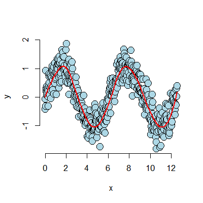
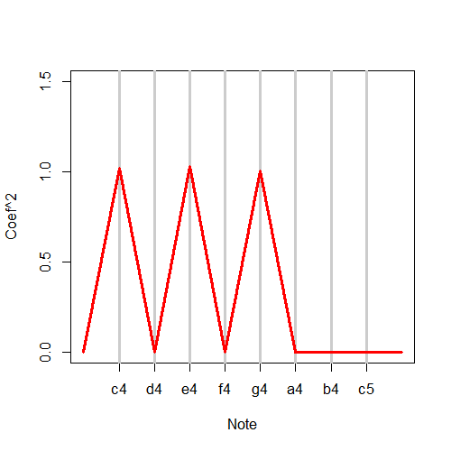
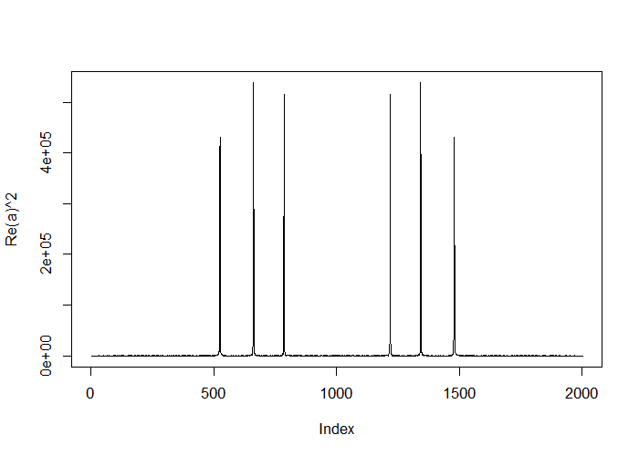

# Bonus material
[Watch this video before beginning.](https://youtu.be/DRKg33tmoAE).

This chapter is a bit of an mishmash of interesting things that one can accomplish with
linear models.

## How to fit functions using linear models
Up to this point, we've only consider fitting lines, planes and polynomials for
linear models.  Consider a model {$$}Y_i = f(X_i) + \epsilon{/$$}.
How can we fit such a model using linear models (often called scatterplot smoothing)?

We're going to cover a basic technique called regression splines. Consider the model

  {$$}
  Y_i = \beta_0 + \beta_1 X_i + \sum_{k=1}^d (x_i - \xi_k)_+ \gamma_k + \epsilon_{i}
  {/$$}

where {$$}(a)_+ = a{/$$} if {$$}a > 0{/$$} and 0 otherwise and {$$}\xi_1 \leq ... \leq \xi_d{/$$}
are known knot points. Prove to yourself that the mean function:

{$$}
\beta_0 + \beta_1 X_i + \sum_{k=1}^d (x_i - \xi_k)_+ \gamma_k
{/$$}
is continuous at the knot points. That is, we could draw this function without lifting up the pen.

Let's try a simulated example. The function is a sine curve with noise. We have
twenty knot points.

{lang=r,line-numbers=off}
~~~
## simulate the data
n <- 500; x <- seq(0, 4 * pi, length = n); y <- sin(x) + rnorm(n, sd = .3)
## the break points of the spline fit
knots <- seq(0, 8 * pi, length = 20);
## building the regression spline terms
splineTerms <- sapply(knots, function(knot) (x > knot) * (x - knot))
## adding an intercept and the linear term
xMat <- cbind(1, x, splineTerms)
## fit the model, notice the intercept is in xMat so we have -1
yhat <- predict(lm(y ~ xMat - 1))
## perform the plot
plot(x, y, frame = FALSE, pch = 21, bg = "lightblue", cex = 2)
lines(x, yhat, col = "red", lwd = 2)
~~~

The plot discovers the sine curve fairly well. However, it has abrupt break points.
This is because our fitted function is continuous at the knot points, but is not
differentiable. We can get it to have one continuous derivative at those points,
by adding squared terms. Adding cubic terms would make it twice continuously differentiable
(so even a little smoother looking). Here's our squared regression spline model:

{$$}
  Y_i = \beta_0 + \beta_1 X_i + \beta_2 X_i^2 + \sum_{k=1}^d (x_i - \xi_k)_+^2 \gamma_k + \epsilon_{i}
{/$$}

{lang=r,line-numbers=off}
~~~
splineTerms <- sapply(knots, function(knot) (x > knot) * (x - knot)^2)
xMat <- cbind(1, x, x^2, splineTerms)
yhat <- predict(lm(y ~ xMat - 1))
plot(x, y, frame = FALSE, pch = 21, bg = "lightblue", cex = 2)
lines(x, yhat, col = "red", lwd = 2)
~~~



Notice how much smoother the fitted (red) curve is now.

## Notes
The collection of regressors is called a basis.
People have spent **a lot** of time thinking about bases for this kind of problem. So, consider this treatment is
just a teaser.  Further note that a single knot point term can fit hockey stick like processes, as long as you know exactly where
the knot point is.

These bases can be used in GLMs as well. Thus, this gives us an easy method for fitting non-linear functions
in the linear predictor. An issue with these approaches in either linear or generarlized linear models
 is the large number of parameters introduced. Most solutions require some method of "regularization". In
 this process the effective dimension is reduced by adding a term that penalizes large coefficients.

## Harmonics using linear models

Finally, we'd like to end with another basis, perhaps the most famous one.
Consider give a musical chord played continuously, could we use linear models
to discover the notes? In the following simulation I consider the piano keys
from middle C for a [full octave](https://en.wikipedia.org/wiki/Octave).  
We're going to generate our chords as sine curves of the specified frequencies.
Then we'll fit a linear model with all of the sine curves and look at which
coefficients seem large. Those would make up our chord. I got the note frequencies
[here](http://www.phy.mtu.edu/~suits/notefreqs.html).

```r
## Chord finder, playing the white keys on a piano from octave c4 - c5
## Note frequencies in the order of C4, D4, E4, F4, G4, A4, B4, C5
notes4 <- c(261.63, 293.66, 329.63, 349.23, 392.00, 440.00, 493.88, 523.25)
## The time variable (how long the chord is played and how frequently it is digitally sampled)
t <- seq(0, 2, by = .001); n <- length(t)
## The notes for a C Major Chord
c4 <- sin(2 * pi * notes4[1] * t); e4 <- sin(2 * pi * notes4[3] * t);
g4 <- sin(2 * pi * notes4[5] * t)
## Create the chord by adding the three together
chord <- c4 + e4 + g4 + rnorm(n, 0, 0.3)
## Create a basis that has all of the notes
x <- sapply(notes4, function(freq) sin(2 * pi * freq * t))
## Fit the model
fit <- lm(chord ~ x - 1)
```



It is interesting to note that what we're accomplishing is highly related to the
famous Discrete Fourier Transform. This is an automatic what to fit all sine and
cosine terms available to a set of data. And, the Fast (Discrete) Fourier Transform (FFT)
does it about as fast as possible (faster than fitting the linear model). Here,
I give some code to show taking the FFT and plotting the coefficients. Notice it
lodes on the three notes comprising the chords.

{lang=r,line-numbers=off}
~~~
##(How you would really do it)
a <- fft(chord); plot(Re(a)^2, type = "l")
~~~




## Thanks!

Thanks for your time and attention in reading this book. I hope that you've learned some of the basics
of linear models and have internalized that these are some incredibly powerful tools. As a next direction,
you might consider more coverage of generalized linear models, or looking at the specific cases for
correlated data. Thanks again!

Brian
